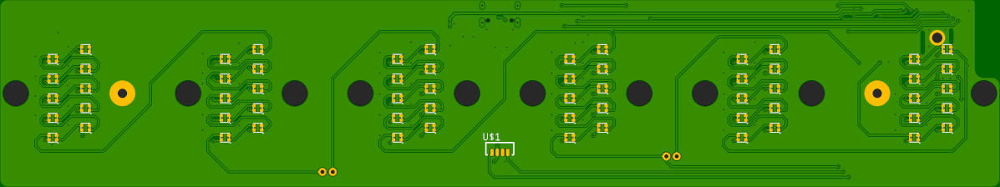
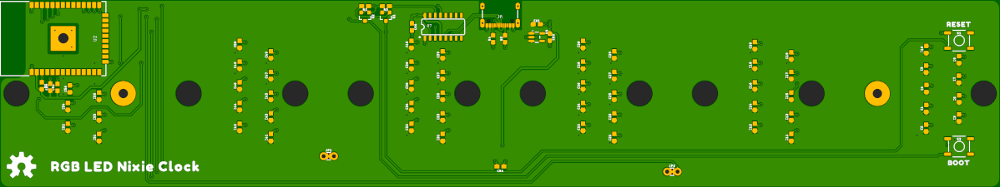
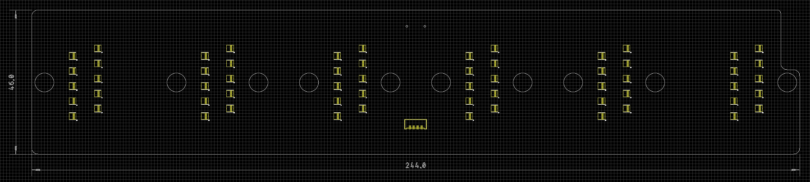

# RGB LED Glow Tube Clock

A drop-in replacement PCB for one of the popular LED "Nixie" Glow Tube Clocks available through the usual suppliers.

Features:

* ESP32 WROOM processor - uses WiFi to obtain network time from an NTP server
* 60 x WS2812-2020 2mm x 2mm RGB LEDs - to illuminate the engraved acrylic glow tube digits
* VEML7700 ambient light (lux) sensor - the lux can be used to adjust the LED brightness
* USB-C interface - for 5V power and firmware updates

Enjoy!

**_Paul_**

## Licence

Please see [LICENSE.md](./LICENSE.md) for details.

